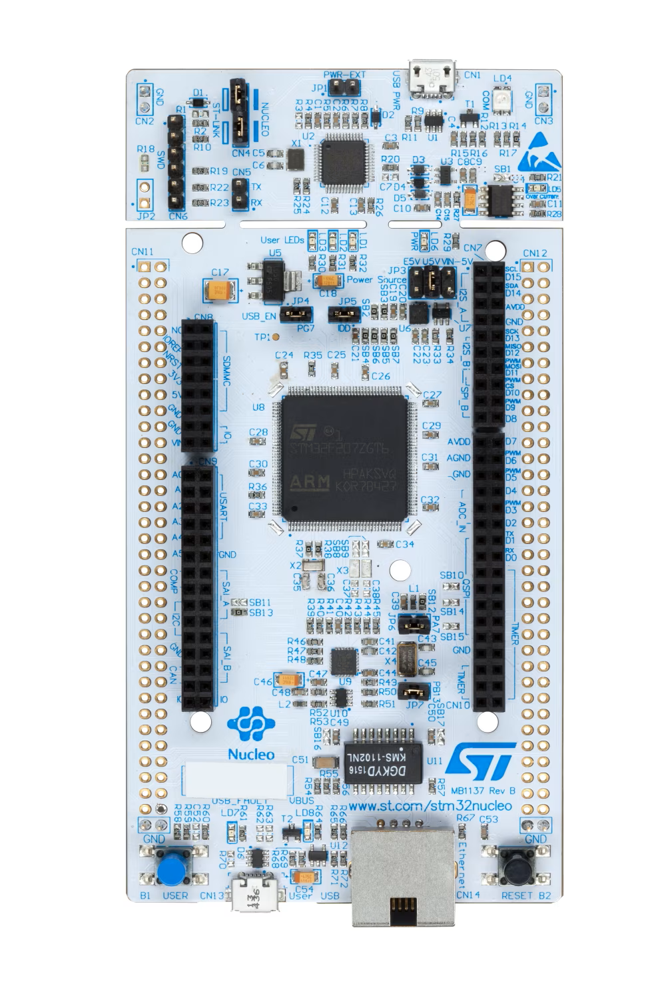

# XDR - eXperimental Driver
Bare-metal STM32F767 firmware drivers (GPIO, RCC, USART, I2C, SPI) built from scratch. 

## 1. Overview

**XDR (eXperimental Driver)** is a lightweight, low-level driver framework for the STM32F767 microcontroller family.

It is designed without HAL or LL, focusing on:

- Full control of registers
- Clear peripheral abstraction
- Simplified user configurations
- Continuous Integration (CI) pipeline with MISRA compliance checks

The project currently implements:

1. **GPIO Driver** — digital I/O configuration and runtime API
2. **RCC Driver**  — system clock configuration using HSI/PLL, AHB/APB prescalers, and flash wait-states
3. **USART Driver**  — initialization of USART peripherals, data transmission/reception, and support for multiple baud rates with hardcoded GPIO configurations

The drivers rely on a custom reduced CMSIS-style header ([stm32f767xx.h](Drivers/Inc/stm32f767xx.h)) which defines all relevant register maps.


**STM32 Nucleo-144** development board is being used with the STM32F767ZI MCU for testing the drivers.


<p align="center">
    
</p>

## 2. XDR-GPIO Driver

### The GPIO module provides:

- Pin configuration (Mode, Pull-up/down)
- Pin-level read/write
- Port-level read/write
- Pin toggle
- Clock enable/disable per GPIO port

GPIO output speed is hardcoded to high speed, and alternate function (AF) register configurations are integrated into the USART, SPI, and I2C drivers.

```
typedef struct{
GPIO_TypeDef *xdr_gpiox;
xdr_gpio_portId xdr_gpio_portId;
uint8_t xdr_gpio_pin;
uint8_t xdr_gpio_pinMode;
uint8_t xdr_gpio_pinPuPd;
}xdr_gpio;
```

The `xdr_gpio` structure is used to configure GPIO pins.

### Public APIs:

```
void XDR_GPIO_Init(xdr_gpio *xdr_gpio);
void XDR_GPIO_DeInit(const xdr_gpio *xdr_gpio);

uint8_t XDR_GPIO_Read_Pin(xdr_gpio *xdr_gpio, uint8_t xdr_gpio_pin);
uint16_t XDR_GPIO_Read_Port(xdr_gpio *xdr_gpio);

void XDR_GPIO_Write_Pin(xdr_gpio *xdr_gpio, uint8_t xdr_gpio_pin, uint8_t xdr_value);
void XDR_GPIO_Write_Port(xdr_gpio *xdr_gpio, uint16_t xdr_value);

void XDR_GPIO_Toggle(xdr_gpio *xdr_gpio, uint8_t xdr_gpio_pin);
```

## 3. XDR-RCC Driver

### The RCC module provides:

- Switching hardcoded system clock frequencies
- Set AHB/APB1/APB2 prescalers
- Auto-configuration of:
  - PLL multipliers/dividers (hardcoded for stability)
  - Required flash wait states

### Supported System Clock Options
- 16 MHz
- 48 MHz
- 96 MHz
- 144 MHz
- 216 MHz
```
typedef struct{
	RCC_TypeDef 		   *rcc;
	xdr_sysclk_freq 	  sysclk_freq;
	xdr_ahb_prescaler 	ahb_prescaler;
	xdr_apb_prescaler 	apb1_prescaler;
	xdr_apb_prescaler 	apb2_prescaler;
}xdr_rcc;
```

The `xdr_rcc` structure is used to configure the RCC module, allowing users to select the system clock frequency and set the AHB, APB1, and APB2 prescalers.

### Public APIs
```
void XDR_RCC_Init(xdr_rcc *xdr_RCC);
uint32_t XDR_Get_SysClock(void);
uint32_t XDR_Get_HCLK(void);
uint32_t XDR_Get_PCLK1(void);
uint32_t XDR_Get_PCLK2(void);
```
## 4. XDR-USART Driver

### The USART module provides:

- Initialization of USART peripherals
- Transmission and reception of data
- Support for multiple baud rates
- Hardcoded GPIO pin configurations for USART instances
- USART1/2/3/6

```
typedef struct{
    USART_TypeDef       *usart;
    xdr_usart_instance   xdr_usart_instance;
    uint32_t             xdr_usart_baudrate;
}xdr_usart;
```

The `xdr_usart` structure is used to configure the USART module, allowing users to select the USART instance and baud rate.

### Public APIs:

```
void XDR_USART_Init(xdr_usart *xdr_usart);
void XDR_USART_Send(xdr_usart *xdr_usart, uint8_t data);
uint8_t XDR_USART_Receive(xdr_usart *xdr_usart);
```

## 5. Implementation Notes

### Custom CMSIS Header

A minimal version of the STM32F767 register map is provided in [stm32f767xx.h](Drivers/Inc/stm32f767xx.h)

This header includes:

- RCC, GPIO, FLASH, EXTI, SYSCFG register definitions  
- Full peripheral memory map  
- NVIC register definitions  
- Peripheral base addresses  
- Peripheral register structures 

### PLL Hardcoded Configurations

For learning, PLL configurations are currently implemented as **predefined configurations**, such as:

- `XDR_RCC_PLLCFGR_48MHZ`  
- `XDR_RCC_PLLCFGR_96MHZ`  
- `XDR_RCC_PLLCFGR_144MHZ`  
- `XDR_RCC_PLLCFGR_216MHZ`  

These values are applied inside the RCC driver implementation  
(in [stm32f767xx_xdr_rcc.c](Drivers/Src/stm32f767xx_xdr_rcc.c)).

### Flash Wait States

Flash latency is automatically configured based on the selected **SYSCLK** frequency.  

## 6. Goals & Roadmap

### Completed
- GPIO Driver  
- RCC Driver  
- USART Driver
- Minimal CMSIS Hardware Layer 
- MISRA Compliance Checker Integration 

### In Progress / Planned
- SPI Driver  
- I2C Driver